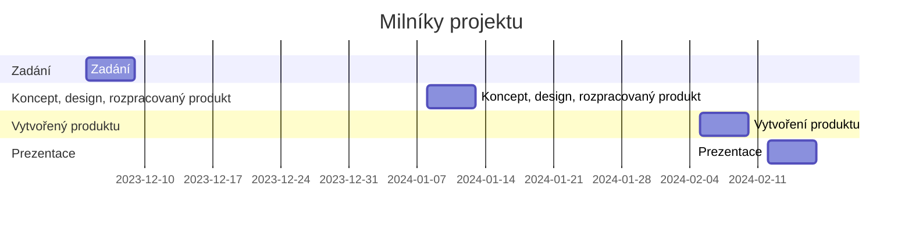

# Projekt Mood Lamp
**Zadání: Rozmyslete, navrhněte, vytvořte zapojení i design, otestujte a vytvořte dokumentaci k Mood Lamp**

Motivace - vytvoření IoT produktu s využitím ESP8266, který bude mít využití v běžném životě. Mood Lamp může sloužit jako atmosférická nebo noční lampička a bude umožňovat obousměrnou komunikaci přes MQTT.

## Termíny
| milník                                | termín              |
| :------------------------------------ | :------------------ |
| Zadání                                | **4.12.-8.12.2023** |
| Koncept, design, rozpracovaný produkt | **8.1.-12.1.2024**  |
| Repo, rozpracovaná dokumentace        | **22.1.-26.1.2024**  |
| Vytvořený produkt                     | **5.2.-9.2.2024**   |
| Termín prezentace                     | **12.2.-16.2.2024**     |

### Ganttův diagram postupu

## Výstup
* produkt splňující minimální požadavky
* prezentace funkčnosti před třídou
* repozitář na GIT s dokumentací
* video prezentující projekt o délce *min. 1. minuty*

## Minimální požadavky
* Vhodný vlastní design
* Základ postavený na ESP
* Použití RGB
  * min. 2x LED / pásek (Neopixel) / kruh
* Měření teploty a vlhkosti
  * doporučený modul DHT11 - digitální výstup
* Komunikace přes MQTT
  * ovládání
  * data z čidel
* Node-RED + UI
  * Předpřipravené flows
  * Ovládání RGB kanálů
  * Přepínání efektů / přednastavených barev
  * Výpis stavu, grafy
    * RGB
    * Teplota
    * Vlhkost
* Připravené na prezentaci
  * Přednastavené WiFi připojení v učebně
  * Vhodný ukázkový kód
* OTA
  * Možnost aktualizace firmwaru přes WiFi
  * (aktualizace pomocí CI/CD)
* Zdrojový kód
  * Přehledný kód
  * Komentáře
  * **Preferujte použití vlastních funkcí a vynechání delay()**
  * Ošetření chyb
* Dokumentace
  * Naplněné standardní Git repo
  * **odzdrojovat převzaté části!**
  * Wiki/Statické stránky - popis zapojení, ovládání, designu, doplněné vhodnými obrázky
  * Mermaid - architektura řešení
  * Fotky
    * Minimálně 5 fotek zapojení jednotlivých částí
    * Z toho alespoň jedna fotka kompletního produktu
  * Video
    * Vložené video/odkaz na video
    * Délka min. 1 minutu (ne delší než 1:30)
      * Ukázka funkčnosti
      * Ukázka designu
      * Ukázka procesu tvorby
      * Z čeho je produkt sestaven
      * (efekty, hudba, humor - volitelně)
      * (případně vložit do videa i ukázku ovládání pomocí Node-RED)

## Možná rozšíření
* I2C LCD
* Napájení z baterie/powerbanky/nabíječky
* Tlačítka
* RTC - > nastavení jako budík

## Postup průběžně dokumentujte pomocí
* Nákresů
* Fotky
* Videa

## Inspirace
[Instructables - návod na RGB Lampu](https://www.instructables.com/circuits/howto/rgb+lamp/)