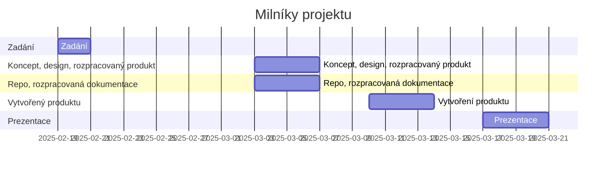

# Projekt Mood Lamp
**Zadání: Rozmyslete, navrhněte, vytvořte zapojení i design, otestujte a vytvořte dokumentaci k Mood Lamp**

Motivace - vytvoření IoT produktu s využitím ESP8266/ESP32, který bude mít využití v běžném životě. Mood Lamp může sloužit jako atmosférická nebo noční lampička a bude umožňovat obousměrnou komunikaci přes MQTT.

## Termíny
| milník                                | termín              |
| :------------------------------------ | :------------------ |
| Zadání                                | **19.02.-20.02.2025** |
| Koncept, design, rozpracovaný produkt | **3.3.-6.3.2025**  |
| Repo, rozpracovaná dokumentace        | **3.3.-6.3.2025** |
| Vytvořený produkt                     | **10.3.-13.3.2025** |
| Termín prezentace                     | **17.3.-20.3.2025** |

[^1]: Změněno na základě požadavků

### Ganttův diagram postupu

## Výstup
* produkt splňující minimální požadavky
* prezentace funkčnosti před třídou
* repozitář na GIT s dokumentací
* video prezentující projekt o délce *min. 1. minuty*

## Minimální požadavky
### Hardware
* Vhodný vlastní design
* Základ postavený na ESP
* Použití RGB
  * pásek (Neopixel) / kruh (Neopixel) / min. 2x RGB LED
* Měření teploty a vlhkosti
  * doporučený modul DHT11/22 - má digitální výstup
### Software
* Komunikace přes MQTT
  * ovládání
  * data z čidel
* Připravené na prezentaci
  * přednastavené WiFi připojení v učebně
  * vhodný ukázkový kód
* Zdrojový kód
  * přehledný kód
  * komentáře
  * **Preferujte použití vlastních funkcí a vynechání delay()**
  * ošetření chyb
#### Rozšíření SW
* OTA
  * možnost aktualizace firmwaru přes WiFi
  * (aktualizace pomocí CI/CD)
### Datové toky + UI
* rozhraní pro vzdálené ovládání
  * doporučuji kouknout na WLED nebo stavět na Node-RED + UI
  * ovládání RGB kanálů
  * přepínání efektů / přednastavených barev
  * výpis stavu, grafy
    * RGB
    * teplota
    * vlhkost
### Dokumentace
* Dokumentace
  * Naplněné standardní Git repo
  * **odzdrojovat převzaté části!**
  * Wiki/Statické stránky - popis zapojení, ovládání, designu, doplněné vhodnými obrázky
  * Mermaid - architektura řešení
  * Fotky
    * Minimálně 5 fotek zapojení jednotlivých částí
    * Z toho alespoň jedna fotka kompletního produktu
  * Video
    * Vložené video/odkaz na video
    * Délka min. 1 minutu (ne delší než 1:30)
      * Ukázka funkčnosti
      * Ukázka designu
      * Ukázka procesu tvorby
      * Z čeho je produkt sestaven
      * (efekty, hudba, humor - volitelně)
      * (případně vložit do videa i ukázku ovládání pomocí Node-RED)
### Možná rozšíření
* I2C LCD
* Napájení z baterie/powerbanky/nabíječky
* Tlačítka
* RTC - > nastavení jako budík
## Postup průběžně dokumentujte pomocí
* Nákresů
* Fotky
* Videa

## Inspirace
[Instructables - projekty RGB lamp](https://www.instructables.com/search/?q=rgb%20lamp&projects=all)